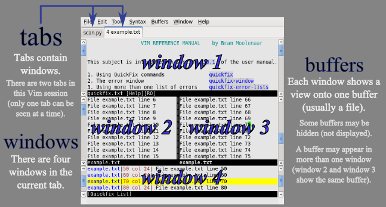

-   [myvim](#myvim)
    -   [Install Vim Plugin Manager](#install-vim-plugin-manager)
    -   [Vim Common Shortcuts](#vim-common-shortcuts)
        -   [Move](#move)
        -   [Multi-file Editing](#multi-file-editing)
        -   [Marks](#marks)
        -   [Redo/Undo](#redoundo)
        -   [Visual Mode](#visual-mode)
        -   [Copy & Paste](#copy-paste)
        -   [Folding](#folding)
        -   [Search](#search)
        -   [Replace (substitute)](#replace-substitute)
        -   [Normal Usage](#normal-usage)

myvim
=====

Install Vim Plugin Manager
--------------------------

1.  install [Vundle](https://github.com/VundleVim/Vundle.vim):

``` {.shell}
git clone https://github.com/VundleVim/Vundle.vim.git ~/.vim/bundle/Vundle.vim
```

2.  Configure Plugins: Copy `vimrc` to `~/.vimrc` and add/remove plugins
    or settings you don't need

Vim Common Shortcuts
--------------------

### Move

#### Character Move

-   `h` left, `5h` move left 5 characters
-   `l` right, `4l` move right 5 characters
-   `j` down, `3j` move down 3 lines
-   `k` up, `2k` move up 2 lines
-   `f<char>` e.g. `fT` move to the first character 'T' in the line
-   `F<char>` e.g. `FT` move back to the first character 'T' in the line

#### Word Move

-   `w` move to next word (head), `4w` move to next 4 words
-   `b` move to previous word (head), `4b` move to previous 4 word
-   `e`/`E` move to the end of word, `2e` move to end of next 2 words
-   `0` move to begin of line
-   `^` move to start of line
-   `$` move to end of line

#### Sentences & Sections Move

-   `( <count>` sentence backward
-   `) <count>` sentence forward
-   `{ <count>` paragraphs backward
-   `} <count>` paragraphs forward
-   `]] <count>` sections forward or to next '{'
-   `][ <count>` sections forward or to next '}'
-   `[[ <count>` sections backward or to previous '{'
-   `[] <count>` sections backward or to previous '}'

#### File Move

-   `:10` move to line 10, `10gg` or `10G` move to line 10
-   `gg` move to begin of file
-   `G` move to end of file

#### Sceen Move

-   `c-f` page down (forward)
-   `c-b` page up (backward)
-   `c-e` sceen down by line
-   `c-y` sceen up by line
-   `zt` top current line
-   `zz` mid current line
-   `zb` button current line
-   `H` move to top of sceen
-   `M` move to middle of sceen
-   `L` move to end of sceen

#### <span id="window-move">Window Move</span>

-   `c-w h` move to left window
-   `c-w j` move to down window
-   `c-w k` move to top window
-   `c-w l` move to right window

#### <span id="tab-move">Tab Move</span>

-   `gt`/`:tabn` move to next tab
-   `gT`/`:tabp` move to previous tab
-   `<i>gt` move to tab in position `i`
-   `:tabs` list all tabs
-   `:tabfirst` move to first tab
-   `:tablast` move to last tab

#### <span id="buffer-move">Buffer Move</span>

-   `bn` move to next buffer
-   `bp` move to previous buffer
-   `b <number, expression>` move to specific buffer by using buffer
    number of part of filename (expression) e.g. `:b 1` or `:b exa` to
    file 'example.html'
-   `:ls` list all buffers
-   `:b <Tab>` show all buffers and if hit 'enter'
-   `:b car<Tab>` show 'car.c car.h'
-   `:b *car<Tab>` show 'car.c jetcar.c car.h jetcar.h'
-   `:b .h<Tab>` show 'vehicle.h car.h jet.h jetcar.h'
-   `:b .c<Tab>` show 'vehicle.c car.c jet.c jetcar.c'
-   `:b ar.c<Tab>` show 'car.c jetcar.c'
-   `:b j*c<Tab>` show 'jet.c jetcar.c jetcar.h'

### Multi-file Editing

The relationship between buffer, tab and window


#### buffer

-   Manager buffer
    -   `vim a.txt b.txt` open files in buffer
    -   `:e[dit] <filename>` open new file in buffer
    -   `:o[open] <filename>` open file to buffer
    -   `:ba[dd] <filename>` add file to buffer
    -   `:bd[elete] <number, expression>` delete buffer e.g. `:bd 3` or
        `:bd exa` (delete file 'example.html' from buffer )
    -   `:ls` or `:buffers` list all buffers 
        > when using `:ls` to list all buffers, you can see the status of buffers: 
        > - `-` not active buffer 
        > - `a` active buffer 
        > - `h` hidden buffer 
        > - `%` current buffer which is visiable in windows 
        > - `#` swap buffer which can be swap by using `c-^` 
        > - `=` readonly buffer 
        > - `+` modified buffer
-   [Move Buffer](#buffer-move)
-   Split buffer to window
    -   `sb <number, expression>` split buffer to new window
        horizontally e.g. `sb 3` or `sb exa` ('example.html')
    -   `vertical sb <number, expression>` split buffer to new window
        vertically
    -   `c-w s` equals to `sb`
    -   `c-w v` equals to `vertical sb`
    -   `c-w c` close the current active window

#### Tab

-   Manager tab
    -   `vim -p a.txt b.txt` open files in tabs
    -   `:tabe[dit] <filename>` open file in tab
    -   `:tabnew <filename>` open file in tab
    -   `:tabc[lose]` close current tab
    -   `:tabc[lose] <i>` close i-th tab
    -   `:tabo[nly]` close other tabs
    -   `:tabm 0` move current tab to first
    -   `:tabm` move current tab to last
    -   `:tabm <i>` e.g. `tabm 2` move current tab to `i+1`
-   [Tab Move](#tab-move)

#### Window

-   Manage Window
    -   `vim -O a.txt b.txt` open file in mutiple windows vertically (if
        using option `-o` horizontally)
    -   `:sp[lit] <filename>` horizontal split
    -   `:new <filename>` equals to `:sp`
    -   `:sv[iew] <filename>` horizontal split readonly
    -   `:vs[plit] <filename>` vertical split
    -   `clo[se]` close current window
    -   `c-w s` horizontal split
    -   `c-w v` vertical split
    -   `c-w c` or `c-w q` close current window
    -   `c-w n` open new file (blank)
    -   `c-w o` close othe windows
    -   `c-w T` move window to new tab
-   [Move Window](#window-move)
    -   `c-w H` move current window to left
    -   `c-w L` move current window to right
    -   `c-w J` move current window down
    -   `c-w K` move current window up
-   Resize the window
    -   `c-w +` size bigger
    -   `c-w -` size smaller
    -   `c-w =` union the size za \#\#\# Jumps
-   `c-o` go back jump points
-   `c-i` go next jump points
-   `c-]` follow link/tags points
-   `:ju` show all jump points
-   **\`.** jump to the last modified (edited) position
-   **'.** jump to the line begin of the last modified position
-   **'0** jump to the last exit in file

### Marks

-   `m<label>` e.g. `ma` current an mark named 'a'
-   **\`a** jump to mark 'a'
-   **'a** jump to the begin of line where the mark
-   `:marks` show all marks
-   `:marks <label>` show detail of mark e.g. `:marks a` show details of
    'a'
-   `:delm <label>` delete a mark
-   `:delm!` delete all marks

### Redo/Undo

-   `u` undo
-   `c-r` redo
-   `:undolist` show undo list
-   `:undo 2` undo to tree 2
-   `:earlier 10s/m/h` undo to 10s/m/h ago

### Visual Mode

-   `v` enter visual mode
-   `c-v` enter block visual mode \#\#\# Special Character
-   `c-v <code>` e.g. `c-v 273` you will get ÿ \#\#\# Auto Complete
-   `c-x c-o` \#\#\# Backup
-   `:set backup` enable backup default filename+\~
-   `:set backupext=.bak` change backup as filename.bak. But if you save
    the save file manay times, the backup will also be override until
    last save
-   `:set patchmode=.orig` keep orignal file as filename.orig \#\#\#
    Edit
-   `a` append after cursor
-   `A` append at end of the line
-   `i` insert before cursor
-   `I` insert before first non-blank
-   `o` open line below
-   `O` open line above
-   `x` delete under and after cursor e.g. `x` delete under cursor or
    `3x` delete cursor + 3
-   `X` delete before cursor
-   `d` delete e.g. `dd` delete line, `3dw` delete 3 word, `3db` delete
    3 word before, `3dj` delete 3 line below and current line, `3dk`
    delete 3 line above and current line, `10, 15d` delete line 10-15
-   `J` join line (put next line in the end of this line)
-   `r` replace the single character
-   `gr` replace without affecting layout
-   `R` replace mode
-   `c`or `s` same as `d` and then enter editing mode
-   `s` same as `dd` and then enter editing mode
-   `~` samrt change case lower -\> upper upper -\> lower
-   `gu` change to lowercase e.g. `2guw` change the next 2 word to
    lowercase, `guG` change all to lowercase
-   `gU` change to uppercase

### Copy & Paste

-   `y` yank line copy `yw` copy next word, `2yw` copy 2 next word,
    `2yl` copy 2 right character, `2yk` copy 2 above line include this
    line, `:10, 15y` copy line 10-15
-   `yy` copy current line
-   `"{a-zA-Z}y` copy info to register {a-zA-Z}
-   `p` paste below
-   `P` paste above
-   `"{a-zA-Z}p` paste from register {a-zA-Z}
-   `:reg` show all register
-   `:16, 20 co 31` copy line 16-20 to 31
-   `:16, 20 m 31` move line 16-20 to 31
-   `ddup` duplicate line
-   `ddp` change line order

### Folding

-   Close/Open
    -   `zo` open folding
    -   `zc` close folding
    -   `zO` open folding under cursor
    -   `zC` close folding under cursor
    -   `zR` open All folding
    -   `zM` close All folding
    -   `za` smart open/close folding
    -   `zA` smart open/close all folding
-   En/Disable
    -   `zn` disable folding
    -   `zN` enable folding
-   Create/Delete
    -   `zf` e.g. `3zf+` or `3zf↓` create 3 line to folding, `zf56G` create folding to line 56, `3zf+` or `3zf↑` create folding up, `zf%` create folding to (`()` , `{}`, `[]`, or `<>`)
    -   `zd` delete fold at cursor line
    -   `zD` delete all folds at the cursor line
    -   `:set foldmethod=indent` Ford by indent, very useful for python
-   Moving
    -   `zj` next folding
    -   `zk` previous folding

### Search

- Using regular expression during search 
    - `/text` search text forward, hit `n` to next or `N` to prefious 
    - `?text` search text backward, hit `n` to next or `N` to prefious 
    > Some characters need to escape: \.\*\[\]\^\%\/\?\~\$
-  search the word under cursor forward 
    - `#` search the word under cursor backward 
    - `/foo/c` ignore case when search 
    - `/foo/C` not ignore case 
    - `set ignorecase` case sensitive - `set smartcase` if there is an uppercase letter, switch to case sensitive lookup 
    - `nohlsearch` or `nohl` not high light search

### Replace (substitute)

#### Scope

-   `s/abc/ade/g` scope is current line
-   `%s/abc/ade/g` scope is whole file
-   `:'<,'>s/abc/ade/g` after visual mode
-   `:2, 5s/abc/ade/g` scope is line 2-5
-   `:.,+2s/abc/ade/g` scope is current line and the next 2 line
    \#\#\#\# Mark
-   `s/abc/ade/` 1st appear then replace
-   `s/abc/ade/g` gobal replace
-   `s/abc/ade/i` ignore case
-   `s/abc/ade/gc` replace and need be confirmed

### Normal Usage

-   add comments

`c-v` select the first line, then `shit-I` and type '//' or '\#' (in
python), ``` esc esc ```
